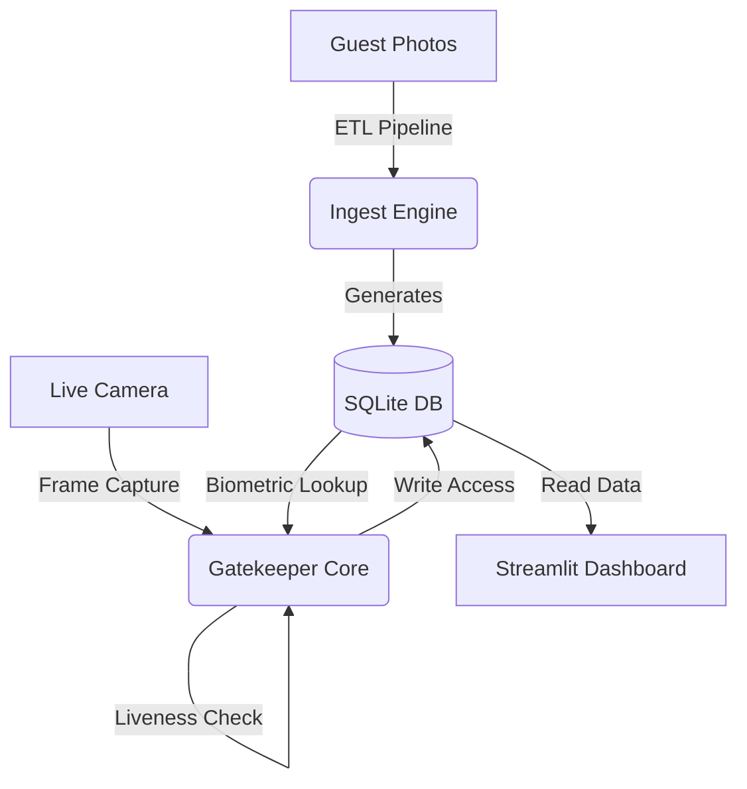

# EventGuard: Biometric Access Control System


> A production-grade computer vision pipeline for secure event entry, featuring liveness detection, encrypted biometric storage, and real-time analytics.

## Architecture

EventGuard operates as a distributed system with three distinct micro-components:



1. **Ingestion Engine (ETL):** Sanitizes raw images, extracts 128-d facial embeddings, and stores them in an encrypted SQLite database.
2. **Gatekeeper Core:** Real-time face matching with per-face liveness verification (blink, head pose, mouth movement challenges) to prevent photo spoofing.
3. **Command Center:** An authenticated Streamlit dashboard for monitoring occupancy and entry logs.

---

## Key Features

* **Multi-Factor Liveness Detection:** Implements Eye Aspect Ratio (EAR), head pose estimation, and mouth movement detection with randomized challenge-response prompts.
* **Encrypted Biometric Storage:** Facial encodings stored in SQLite with AES encryption via the `cryptography` library. No more insecure pickle files.
* **Per-Face State Tracking:** Each detected face independently verifies liveness, preventing shared-state bypass attacks.
* **Dashboard Authentication:** Protected Streamlit dashboard with configurable credentials via environment variables or `st.secrets`.
* **Atomic Database Operations:** SQLite with WAL mode, retry logic, and proper transaction management replaces fragile CSV file I/O.
* **Comprehensive Logging:** Structured Python logging with configurable levels and file output for audit trails.

---

## Project Structure

```text
event_guard/
├── assets/
│   └── guest_photos/      # Drop raw guest images here
├── data/
│   └── eventguard.db      # SQLite database (auto-generated)
├── src/
│   ├── config.py           # Centralized configuration with validation
│   ├── database.py         # SQLite storage layer
│   └── utils.py            # CV utilities, liveness, encryption
├── tests/
│   ├── test_utils.py       # Unit tests for utilities
│   └── test_database.py    # Integration tests for database
├── ingest.py               # ETL Pipeline (Run this first)
├── gatekeeper.py           # Main CV Application
├── dashboard.py            # Authenticated Analytics Interface
├── requirements.txt        # Dependencies
├── .env.example            # Environment variable template
└── pytest.ini              # Test configuration
```

---

## Installation

### Prerequisites

- **Python 3.9+**
- **CMake** (required for building dlib from source)
- **C++ compiler** (gcc/g++ on Linux, Xcode CLT on macOS, Visual Studio on Windows)

### Platform-Specific dlib Setup

**Linux (Ubuntu/Debian):**
```bash
sudo apt-get update
sudo apt-get install -y build-essential cmake libopenblas-dev liblapack-dev
pip install dlib
```

**macOS:**
```bash
xcode-select --install
brew install cmake openblas
pip install dlib
```

**Windows:**
```bash
# Install Visual Studio Build Tools with C++ workload, then:
pip install cmake
pip install dlib
```

> **Note:** If building dlib from source fails, you can try `conda install -c conda-forge dlib` as an alternative.

### Install Dependencies

```bash
# Clone the repository
git clone https://github.com/Dotunbey/EventGuard_Attendance_Taker.git
cd EventGuard_Attendance_Taker

# Create virtual environment
python -m venv venv
source venv/bin/activate  # Linux/macOS
# venv\Scripts\activate   # Windows

# Install all dependencies
pip install -r requirements.txt
```

### Configuration

```bash
# Copy environment template and configure
cp .env.example .env

# Edit .env to set:
# - EVENTGUARD_ENCRYPTION_KEY (required for production)
# - EG_DASHBOARD_USERNAME / EG_DASHBOARD_PASSWORD (optional)
```

### Verify Installation

```bash
python -c "import dlib; print('dlib:', dlib.__version__); import face_recognition; print('face_recognition OK')"
```

---

## Usage Guide

### Phase 1: Ingestion (Build the Database)

1. Add photos of your guests (e.g., `Elon_Musk.jpg`) to `assets/guest_photos/`.
2. Run the ETL pipeline:
```bash
python ingest.py
```

### Phase 2: Run the System

Open **two separate terminals**:

**Terminal 1: Dashboard**
```bash
streamlit run dashboard.py
```

**Terminal 2: Gatekeeper**
```bash
python gatekeeper.py
```

* Look at the camera.
* Follow the liveness challenge prompt (blink, look left/right, or open mouth).
* Watch the Dashboard update!

### Running Tests

```bash
pytest
```

---

## Troubleshooting

**"Unsupported image type" Error**
The `ingest.py` script includes robust image loading that handles memory stride issues automatically.

**Camera lags or crashes**
Set `EG_FRAME_RESIZE_SCALE` to a lower value (e.g., `0.15`) in your `.env` file.

**Database issues**
Delete `data/eventguard.db` and re-run `python ingest.py` to rebuild from scratch.

---

## License

Distributed under the MIT License. See `LICENSE` for more information.
