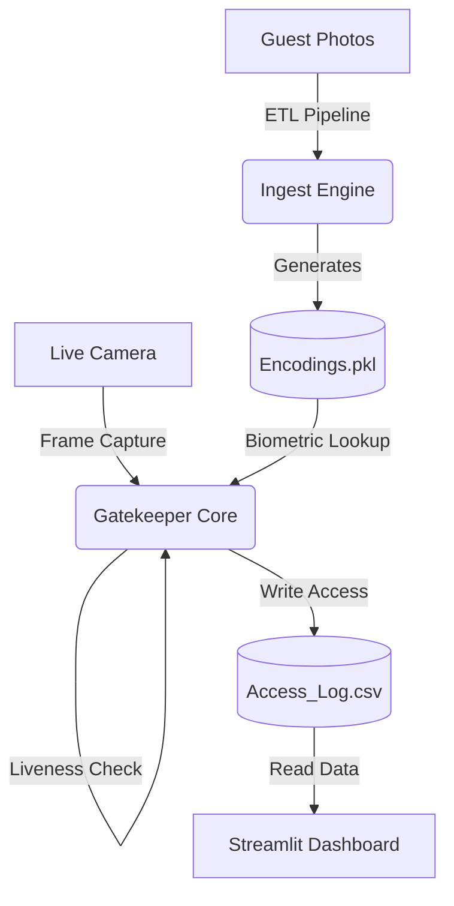

# 🛡️ EventGuard: Biometric Access Control System


> **A production-grade computer vision pipeline for secure event entry, featuring liveness detection, O(1) state management, and real-time analytics**


## 📖 Table of Contents
- [Architecture](#-architecture)
- [Key Features](#-key-features)
- [Project Structure](#-project-structure)
- [Installation (Windows Special Config)](#-installation-windows-special-configuration)
- [Usage Guide](#-usage-guide)
- [Troubleshooting](#-troubleshooting)


## 🏗 Architecture

EventGuard operates as a distributed system with three distinct micro-components:



1. **Ingestion Engine (ETL):** A robust pipeline that sanitizes raw images (handling rotation/stride issues), extracts 128-d facial embeddings, and compiles a serialized binary database.
2. **Gatekeeper Core:** The specific edge-node application. It performs real-time face matching and **liveness verification** (blink detection) to prevent photo spoofing.
3. **Command Center:** A reactive Streamlit dashboard for organizers to monitor occupancy and entry logs in real-time.

---

## 🚀 Key Features

* **🔒 Anti-Spoofing Liveness:** Implements Eye Aspect Ratio (EAR) logic. Static photos cannot bypass the gate; the user must blink to verify humanity.
* **⚡ O(1) State Management:** Uses in-memory caching (Sets) to check if a user is "Already Inside." This prevents pass-back fraud and eliminates CSV read-lag, even with 10,000+ guests.
* **🛡️ Robust Image Sanitization:** Custom memory-stride logic handles corrupted or high-res images (e.g., 4K iPhone HEIC/JPG) that typically crash standard `dlib` implementations.
* **📊 Zero-Lag Logging:** Decoupled logging logic ensures the camera feed maintains 30+ FPS while writing to disk.

---

## 📂 Project Structure

```text
event_guard/
├── assets/
│   └── guest_photos/     # 📸 Drop raw guest images here
├── data/
│   ├── encodings.pkl     # 🧠 Generated biometric database
│   └── access_log.csv    # 📝 Live entry logs (Auto-generated)
├── src/
│   ├── config.py         # ⚙️ Centralized configuration
│   └── utils.py          # 🛠️ Shared CV & IO utilities
├── ingest.py             # 🔄 ETL Pipeline (Run this first)
├── gatekeeper.py         # 👁️ Main CV Application
├── dashboard.py          # 📈 Analytics Interface
└── requirements.txt      # 📦 Dependencies list

```

---

## ⚙️ Installation (Windows Special Configuration)

This project utilizes `dlib` for 99.38% accurate face recognition. On Windows, compiling C++ libraries can be difficult. We use a **pre-compiled wheel** configuration to ensure stability.

### 🛑 Prerequisite: Python 3.8 Environment (For AI Core)

*It is highly recommended to use Python 3.8 for the AI components (`ingest.py` and `gatekeeper.py`) to match the pre-built wheels.*

**1. Clone the repository**

```bash
git clone [https://github.com/your-username/event-guard.git](https://github.com/your-username/event-guard.git)
cd event-guard

```

**2. Create a dedicated virtual environment**

```bash
# We use Python 3.8 to match the pre-built wheel
py -3.8 -m venv face-env-ingest

```

**3. Activate the environment**

```bash
face-env-ingest\Scripts\activate

```

**4. Install Dependencies (The "Magic" Fix)**
We install a specific `numpy` version and the custom `dlib` wheel provided by `z-mahmud22` to bypass build errors.

```bash
# Upgrade build tools
python -m pip install --upgrade pip setuptools wheel

# Install compatible Numpy
pip install "numpy==1.26.4"

# Install pre-compiled Dlib (No Visual Studio required)
pip install [https://github.com/z-mahmud22/Dlib_Windows_Python3.x/raw/main/dlib-19.22.99-cp38-cp38-win_amd64.whl](https://github.com/z-mahmud22/Dlib_Windows_Python3.x/raw/main/dlib-19.22.99-cp38-cp38-win_amd64.whl)

# Install remaining stack
pip install opencv-python face_recognition pillow streamlit scipy

```

**5. Verify Installation**

```bash
python -c "import dlib; print('dlib:', dlib.__version__); import face_recognition; print('face_recognition:', face_recognition.__version__)"

```

*Expected Output:* `dlib: 19.22.99`

---

## 🎮 Usage Guide

We run the system as two separate processes. You can run the Dashboard in your standard environment, but the Gatekeeper **must** run in the compatible `face-env-ingest`.

### Phase 1: Ingestion (Build the Database)

1. Add photos of your guests (e.g., `Elon_Musk.jpg`) to `assets/guest_photos/`.
2. Run the ETL pipeline (using the AI environment):
```bash
face-env-ingest\Scripts\activate
python ingest.py

```


*Output: `🎉 Database compiled. Total identities: X*`

### Phase 2: The Event (Run the System)

Open **two separate terminals** to simulate the Control Room and the Gate.

**Terminal 1: The Command Center (Dashboard)**
*Runs on standard Python (3.8 - 3.13)*

```bash
# Activate your standard environment (e.g., myenv)
myenv\Scripts\activate

# Install Dashboard dependencies if needed
pip install streamlit pandas

# Launch Dashboard
streamlit run dashboard.py

```

*A browser window will open showing the live feed.*

**Terminal 2: The Gatekeeper (AI Core)**
*Requires the Dlib-compatible environment*

```bash
# Activate the special AI environment
face-env-ingest\Scripts\activate

# Launch Camera
python gatekeeper.py

```

* **Look at the camera.**
* **Blink** when prompted.
* Watch the Dashboard update instantly!

---

## 🔧 Troubleshooting

**"Unsupported image type" Error**
If you see this during ingestion, do not worry. The `ingest.py` script includes a custom `robust_load()` function that automatically fixes memory stride issues and converts images to a `dlib`-compatible format.

**Camera lags or crashes**
Ensure you are running the `gatekeeper.py` with the GPU-optimized `opencv-python`. If lag persists, check `src/config.py` and lower the `FRAME_RESIZE_SCALE`.

**"EmptyDataError" on Dashboard**
If the dashboard crashes on startup, simply delete the `data/access_log.csv` file. The system will auto-generate it correctly when the first person checks in.

---

## 📜 License

Distributed under the MIT License. See `LICENSE` for more information.

```

```
